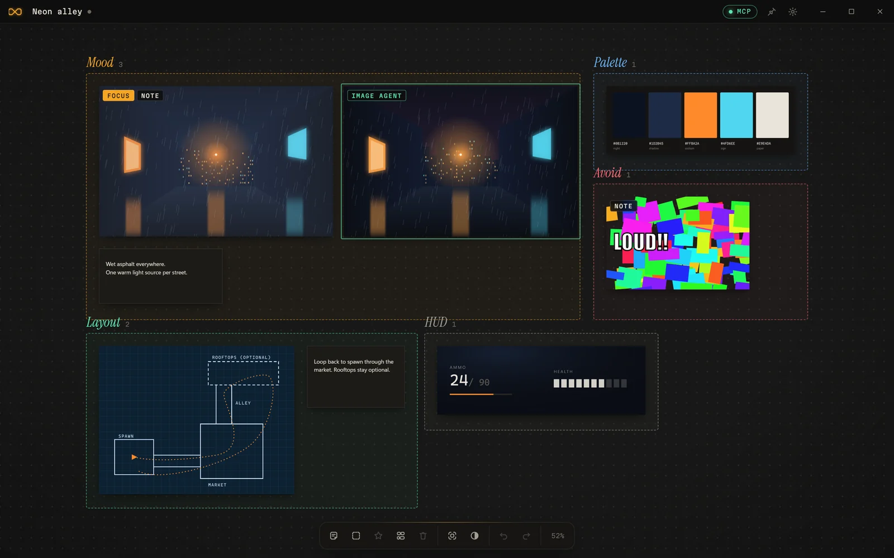
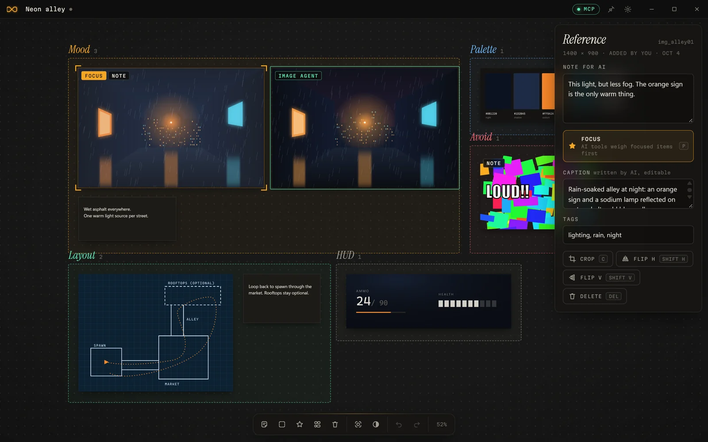
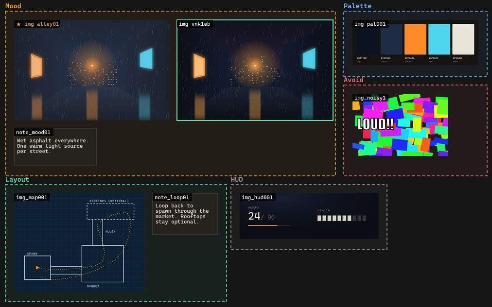
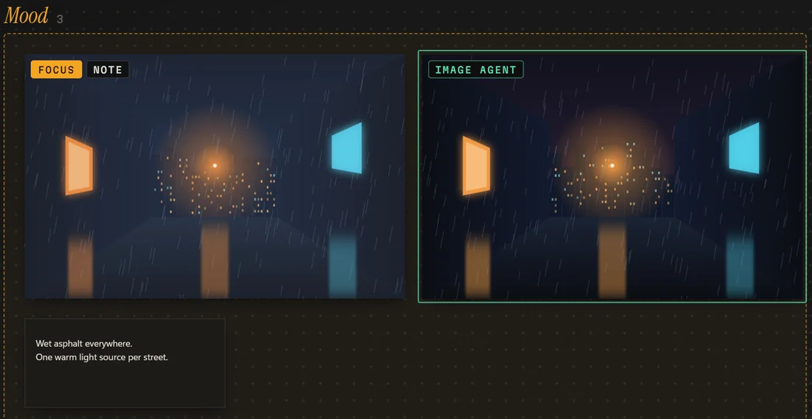
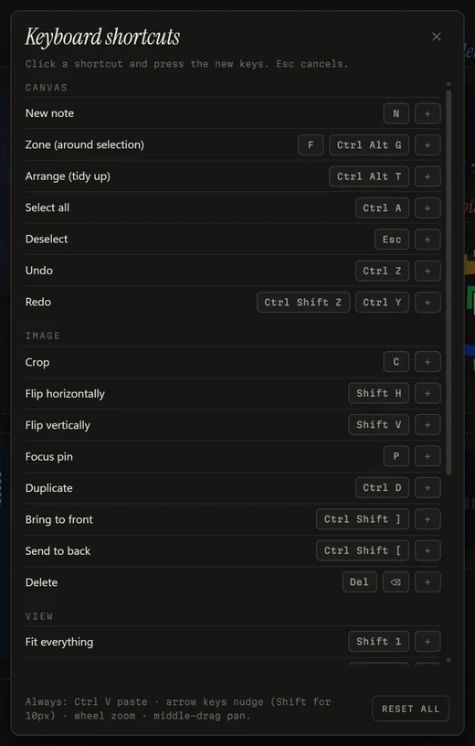
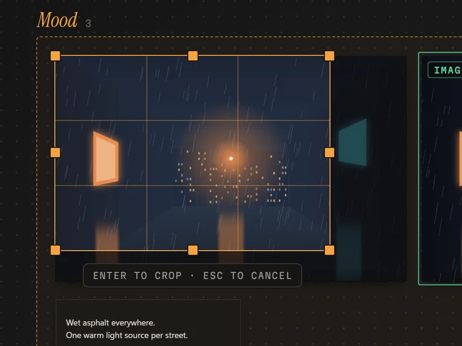
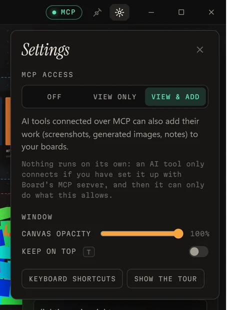

<p align="center">
  
</p>

<h1 align="center">Board</h1>

<p align="center">
  An image board on an infinite canvas, with an MCP server so your AI tools can see it too.
</p>

<p align="center">
  <a href="#quick-start">Quick start</a> ·
  <a href="#connect-your-ai-tools">Connect your AI tools</a> ·
  <a href="#mcp-tools">MCP tools</a>
</p>



Paste, drop and arrange references: screenshots of sites you like, a photo grade, a level layout, a color swatch, things you *don't* want. Start a board for an idea before there's any project, or keep one inside a project folder. Any MCP client can read the board, look at the images and put its own work next to yours: coding assistants, chat apps, agents driving image models.

> Status: early (v0.1). Windows is the primary platform; macOS and Linux should work but are less tested. This is a personal project, so I'm not taking pull requests, but you're welcome to fork it.

## Features

### Tell the model what matters



Give any image a **Note for AI** (“this light, but less fog”), mark the ones that matter most with **Focus**, and group references into named **zones** with a line about what each zone means. Name one *Avoid* and models treat what's inside as anti-references. Captions written by a vision model are cached on the board, so text-only models and later sessions can skip the pixels.

### See what your AI sees

`overview` hands a model the whole board as text, in about 300 tokens for the board above:

```text
# Neon alley: 6 images, 2 notes, 5 zones · updated just now
★ focus: img_alley01
## Mood (zone_mood01, 3) · "Level 3 at night: rain, one warm light source per street."
- img_alley01 ★ "Rain-soaked alley at night: an orange sign and a sodium lamp reflected on wet asphalt, cold blue wa…" · user's note: "This light, but less fog. The orange sign is the only warm thing." · #lighting #rain #night
- img_vnk1eb [by Image agent] "v2: warmer lamp, less fog"
- note_mood01 note: "Wet asphalt everywhere. One warm light source per street."
## Palette (zone_pal001, 1) · "Stick to these. Orange is for interactables only."
- img_pal001 (no caption)
## Avoid (zone_avoid1, 1) · "Anti-references."
- img_noisy1 (no caption) · user's note: "Too busy. Two hues max."
...
```

`view` shows it the board as one image, with ids stamped on so it can ask for any reference at full size:

<p align="center">
  
</p>

### Agents put their work back



An agent can drop a screenshot or a generated image right next to the reference it was aiming for. It appears live, outlined in mint and labelled with the tool's name, and the next iteration can replace it, so the board becomes a side-by-side record of references and attempts.

### Crop, flip, and the keys you already know



Crop is non-destructive: press **C**, drag the edges, **Enter** to apply, **Esc** to cancel, and **Reset crop** brings the whole image back. Flips, duplicate, layer order and zoom use the bindings most image and design tools use (crop as in Photoshop and Affinity; flips, zoom and framing as in Figma).

Every shortcut can be rebound in **Settings → Keyboard shortcuts**: click one, press the new keys.



<br clear="right">

### You decide what AI tools get



MCP access is **off** until you switch it on: **Off**, **View only**, or **View & add**. The app never starts a server on its own, and the server checks the setting on every call, so a change applies immediately. The **MCP** chip in the title bar always shows where it stands.

<br clear="right">

### Local, private and hardened

- **No accounts, no cloud, no telemetry.** Boards are plain JSON and images in `.board/`. The only network request the app ever makes is downloading an image you drag in from a web page, and the MCP server talks over stdin/stdout without opening a port.
- **Untrusted images are re-encoded** by memory-safe decoders before they're stored, which also drops hidden metadata like GPS location.
- **Web downloads can't reach your local network**, and models are told to treat everything on the board as reference material, never as instructions.

### Stays out of your way

- A slim title bar instead of the system frame, **keep on top** (T), and **canvas opacity** that fades only the background, so you can trace over whatever is behind the window while your images stay solid.
- Pastes and new notes appear at a comfortable size for your current zoom.
- A short tour on first launch points out every control.
- Token-frugal MCP: about 820 tokens of fixed context, text first, pixels only on request. See [Token budget](#token-budget).

## Quick start

Prerequisites: Node 20+, pnpm, and the [Tauri prerequisites](https://tauri.app/start/prerequisites/) (Rust + platform WebView).

```bash
git clone https://github.com/HesNotTheGuy/board.git
```

```bash
cd board && pnpm install
```

Build the desktop app and its installer (`--bundles nsis` skips the MSI, which needs a one-time WiX download):

```bash
pnpm app:build --bundles nsis
```

On Windows the installer lands in `app/src-tauri/target/release/bundle/nsis/`. Or run it in development mode with live reload; the UI is served from `localhost:1420`, reachable only from your machine:

```bash
pnpm app
```

Build the MCP server:

```bash
pnpm --filter @board/mcp build
```

### Connect your AI tools

**MCP access is off until you turn it on.** The app never starts an MCP server; an AI tool only connects if you set it up as below, and even then Board's server answers every call with “MCP access is off” until you choose **View only** or **View & add** in the app's settings (the gear, top right). The **MCP** chip in the title bar shows the current state (grey off, blue view only, green view and add), and a change applies on the very next call.

The server is a standard stdio MCP server, so any MCP client can run it. Most clients take a JSON entry like this (where the file lives depends on the client; check its docs):

```json
{
  "mcpServers": {
    "board": {
      "command": "node",
      "args": ["/path/to/board/packages/mcp/dist/index.js", "--root", "/path/to/your/project"]
    }
  }
}
```

Claude Code, for example, has a one-liner. It starts servers inside your project, so `--root` isn't needed:

```bash
claude mcp add board --scope user -- node /path/to/board/packages/mcp/dist/index.js
```

**Finding the board:** the server uses `--root <dir>`, then the `BOARD_ROOT` env var, then the nearest folder above its working directory that has a `.board/` (like git does). Coding tools usually start servers in your project, so nothing extra is needed; desktop chat apps usually don't, so give them `--root`.

**Naming:** items an agent adds are labelled with the name its client reports during the MCP handshake (“Claude Code”, “Cursor”, …). Set `BOARD_AGENT_NAME` in the server's environment to override it, for example for a script or image pipeline.

Then in the app, start a **New board** for an idea, or **Open project folder** (Ctrl O) to keep the board with a project. Paste or drop references. Ask your assistant for anything visual; it calls `overview` on its own when the work is visual, or just say “check the board”.

### Boards without a project

Ideation often comes first. **New board** on the home screen creates a standalone board in the app's data folder, no project needed. AI tools reach it through the `boards` tool (“use the Neon alley board”), so a chat app or an image agent can work with a mood board that has no code attached. When the project exists, **Move to project…** in the top bar moves the board into that folder, and tools working there pick it up automatically.

To delete a board, click the logo (top left) and use the trash button next to it under **Your boards**. It asks first, then moves the board to the Recycle Bin / Trash, so it can be restored. The **×** next to a recent project only removes it from the list; Board never deletes anything inside your project folders.

### UI-only dev mode

```bash
pnpm dev
```

Opens the canvas in a plain browser at `http://localhost:1420` with an in-memory backend (nothing saved). Add `?demo` for a sample board; `__boardDemo.agentAdds()` in the console simulates an agent adding an image.

## Using the board

Select an image to give it a **Note for AI**. Zones carry meaning too: AI tools see every item grouped under its zone, with the zone's name and its **What this zone means** text, and can look at one zone on its own. An item belongs to the zone its center sits in.

<details>
<summary><b>Keyboard shortcuts</b> (all rebindable except paste, arrow-key nudging, wheel zoom and middle-drag pan)</summary>

| Action | Keys |
| --- | --- |
| All boards, new board, open a project | Click the logo (top left) |
| Paste image, image link, or text (→ note) | Ctrl V |
| Add from a browser | Drag the image onto the canvas |
| Pan | Space + drag, or middle mouse |
| Zoom | Wheel / pinch, Ctrl + / Ctrl − |
| Select / add to selection | Click / Shift-click, drag on empty canvas |
| Resize | Drag a corner mark (Shift = free aspect) |
| Crop (then drag edges; Enter applies, Esc cancels) | C |
| Flip horizontally / vertically | Shift H / Shift V |
| Duplicate | Ctrl D |
| Bring to front / send to back | Ctrl Shift ] / Ctrl Shift [ |
| New note | N |
| Zone (around the selection) | F or Ctrl Alt G |
| Arrange (tidy up, per zone) | Ctrl Alt T |
| Focus pin (AI tools weigh these most) | P |
| Fit everything / zoom to selection / 100% | Shift 1 / Shift 2 / Shift 0 |
| Grayscale view (value check) | G |
| Keep on top (also the pin, top right) | T |
| Undo / redo | Ctrl Z / Ctrl Shift Z or Ctrl Y |

</details>

## MCP tools

| Tool | What it does |
| --- | --- |
| `overview` | Text manifest: zones, item ids, your notes, focus pins, cached captions. Big boards are summarized per zone; `zone` lists one in full. Enough for text-only models. |
| `view` | Pixels. No ids: the whole board (or a zone) as one image with ids stamped on. With ids: those references. |
| `add` | Puts an image (`path`) or a note (`text`) on the board, optionally `near` a reference or `replaces` an earlier version. |
| `caption` | Caches short captions so later sessions and text-only models can skip the pixels. |
| `remove` | Removes agent-added items. It can't remove yours. |
| `boards` | Lists this project's board and standalone ones; `use` switches, `create` starts a standalone board. |

The server also sends short instructions on when to look and how to weigh focus pins, notes and zones.

### With image models

Image generators don't speak MCP themselves, but the agent or script driving them can:

1. Read the direction: `overview` for the notes, captions and zones; `view` with ids for the actual reference images.
2. Generate with whatever model you use, feeding it those references and notes.
3. Put the result back with `add` and `near` set to the reference it was aiming for, and `replaces` for the next iteration, so the board becomes a side-by-side record of references and attempts.

### Token budget

Measured with `pnpm --filter @board/mcp bench` (text ≈ characters / 4, images ≈ width × height / 750):

| | Tokens |
| --- | --- |
| Fixed per session (instructions + 6 tool definitions) | ~820 |
| `overview`, small board | ~170 |
| `overview`, 120 items (summarized per zone) | ~1,100 |
| `view`, whole board (any shape) | ≤ ~880 |
| `view`, one reference (768 px) | ~540 |

Ways it stays lean: tool definitions are hand-written and minimal (inputs are validated strictly on the server instead of in the schema), images are sized for the job (ask for up to 1568 px with `max_edge` when detail matters), captions let later sessions skip pixels entirely, and every result is bounded. Rendering the whole board runs in parallel with a tile cache (about 0.2 s for 120 images).

## Should `.board/` be committed?

Your call. It's plain JSON plus content-addressed images, so it diffs and merges reasonably. If your references are copyrighted or large, add `.board/` to your project's `.gitignore`.

## Repo layout

```
packages/format   board.json types, lenient parser, 3-way merge (shared)
packages/mcp      MCP server (Node, sharp for image work)
app               Tauri desktop app (vanilla TS canvas + Rust shell)
docs/FORMAT.md    on-disk format and the concurrency protocol
```

```bash
pnpm test
```

```bash
pnpm typecheck
```

## Roadmap

- Arrows and markup on images
- Click-through window mode
- `npx` install for the MCP server
- Image-model helpers: generation briefs with extracted palettes, reference export for img2img and style-reference pipelines

## License

MIT © HesNotTheGuy
